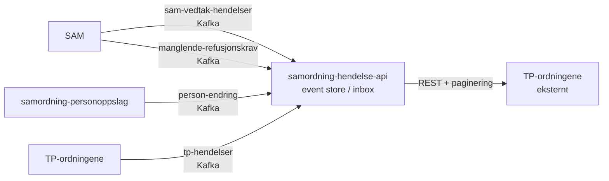

# samordning-hendelse-api

[](https://github.com/navikt/samordning-hendelse-api/actions)

Event store og inbox for hendelser i samordningsdomenet — konsumerer fra Kafka og tilbyr hendelsene via paginert REST til eksterne tjenestepensjonsordninger (TP).

Samordningspliktige hendelser gjelder vedtak, ytelseskrav og manglende refusjonskrav. Personhendelser dekker alle personer i NAV (ekskludert Freg).

## Arkitektur



## REST API

Alle endepunkter krever Maskinporten-token med scope `nav:pensjon/v1/samordning` og validert TP-orgnummer.

### Felles spørreparametere

| Parameter | Påkrevd | Standard | Beskrivelse |
|-----------|---------|----------|-------------|
| `tpnr` | ✅ | — | TP-ordningens nummer (4 siffer) |
| `sekvensnummer` | — | `1` | Start fra dette sekvensnummeret |
| `side` | — | `0` | Sidenummer for paginering |
| `antall` | — | `10000` | Antall hendelser per side (maks 10000) |

### Endepunkter

| Metode | Sti | Beskrivelse |
|--------|-----|-------------|
| `GET` | `/hendelser/vedtak` | Vedtakshendelser fra SAM |
| `GET` | `/hendelser/ytelser` | TP-ytelsehendelser fra TP-ordningene |
| `GET` | `/hendelser/personer` | Personendringer fra samordning-personoppslag |
| `GET` | `/hendelser/manglendeRefusjonskrav` | Manglende refusjonskrav (BSAM002) fra SAM |
| `GET` | `/hendelser` | Alias for `/hendelser/vedtak` |

## Kafka-topics

| Topic | Retning | Kilde |
|-------|---------|-------|
| `pensjonsamhandling.sam-vedtak-hendelser-p` | Konsumerer | SAM — vedtakshendelser |
| `pensjonsamhandling.manglende-refusjonskrav` | Konsumerer | SAM — BSAM002-varsler |
| `pensjonsamhandling.person-endring` | Konsumerer | samordning-personoppslag — PDL-hendelser |
| `pensjonsamhandling.tp-hendelser` | Konsumerer | TP-ordningene — ytelseshendelser |

## Tech stack

Kotlin · Spring Boot · PostgreSQL · Flyway · Nais (FSS/GCP) · Maskinporten · Kafka

## Bygg og test

```bash
./gradlew test
./gradlew build
```

## Deploy

Deployes via GitHub Actions ved push til `master`.

| Miljø | Plattform | Ingress |
|-------|-----------|---------|
| Dev (q2) | GCP | `https://samordning-hendelse-api-q2.ekstern.dev.nav.no` |
| Prod | FSS | `https://samordning-hendelse-api.intern.nav.no` |
| Prod | FSS | `https://samordning-hendelse-api.prod-fss-pub.nais.io` |

## Observability

- **Metrics:** Prometheus på `/actuator/prometheus`
- **Traces:** OpenTelemetry auto-instrumentation → Grafana LGTM + Elastic APM
- **Logger:** Loki

## API-dokumentasjon

- [Preprod (API Portal)](https://api-portal-preprod.nav.no/docs/services/pensjon-samordning/operations/hendelserUsingGET)
- [Prod (API Portal)](https://api-portal.nav.no/docs/services/nav-pensjon-v1-samordning/operations/HendelserGet)

## Risiko- og sårbarhetsanalyse (ROS)

- [PersonFeedController](docs/ros/ros-person-feed.md)
- [ManglendeRefusjonFeedController](docs/ros/ros-manglende-refusjon-feed.md)

Generer PDF: `cd docs/ros && python3 generate-pdf.py`

## Kontakt

- **Team:** Pensjonsamhandling
- **Slack:** [#samhandling_pensjonsområdet](https://nav-it.slack.com/archives/samhandling_pensjonsområdet)
- **Issues:** Spørsmål om koden kan stilles som issues her på GitHub